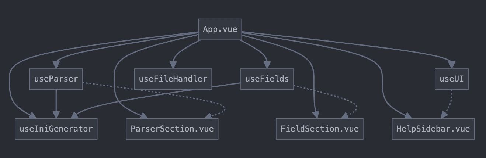

# Application Structure Overview

## 1. Core Files Organization
```
src/
├── App.vue                 # Main application component
├── components/            # UI Components
│   ├── ParserSection.vue   # Parser configuration form
│   ├── FieldSection.vue    # Field configuration form
│   ├── AddFieldButton.vue  # Button to add new fields
│   └── HelpSidebar.vue     # Help documentation sidebar
├── composables/           # Reusable Logic
│   ├── useParser.js        # Parser state & operations
│   ├── useFields.js        # Fields management
│   ├── useUI.js            # UI state management
│   ├── useFileHandler.js   # File operations
│   └── useIniGenerator.js  # INI file generation
├── constants/            # Shared Constants
│   └── parser.js          # Configuration constants
├── utils/               # Utility Functions
│   ├── validation.js      # Validation helpers
│   └── file.js           # File handling helpers
└── i18n/                # Internationalization
    ├── index.js          # i18n setup
    ├── locales/          # Combined translations
    └── messages/         # Individual translation files
```

## 2. Data Flow and Component Interactions



## 3. Key Components and Their Roles

### App.vue (Main Container)
- Orchestrates all components and composables
- Manages global state through composables
- Handles high-level operations

### Composables
- **useParser**: Manages parser configuration state
- **useFields**: Handles field sections state and operations
- **useUI**: Controls UI state (sidebars, dropdowns, toasts)
- **useFileHandler**: Handles file uploads and parsing
- **useIniGenerator**: Generates INI output

### UI Components
- **ParserSection**: Parser configuration form
- **FieldSection**: Individual field configuration
- **HelpSidebar**: Documentation and help
- **AddFieldButton**: Adds new field sections

## 4. Key Data Flows

1. **Parser Configuration**:
```
useParser -> App.vue -> ParserSection.vue -> useIniGenerator
```

2. **Field Management**:
```
useFields -> App.vue -> FieldSection.vue -> useIniGenerator
```

3. **File Operations**:
```
useFileHandler -> App.vue -> useParser/useFields -> useIniGenerator
```

## 5. State Management

### Parser State (useParser)
```javascript
{
  info: '',
  name: '',
  comment_mark: '#',
  coor_x: 'COORX',
  // ... other parser properties
}
```

### Fields State (useFields)
```javascript
{
  fieldSections: [...],  // Array of field configurations
  validationErrors: {},  // Validation state
  // ... methods for field management
}
```

### UI State (useUI)
```javascript
{
  showHelpSidebar: false,
  currentHelpSection: '',
  isDropdownOpen: false,
  // ... other UI states
}
```

## 6. Data Flow Example
When a user modifies a field:
1. User input in FieldSection
2. Event emitted to App.vue
3. App.vue updates state via useFields
4. useIniGenerator watches changes
5. New INI code generated
6. UI updates with new preview